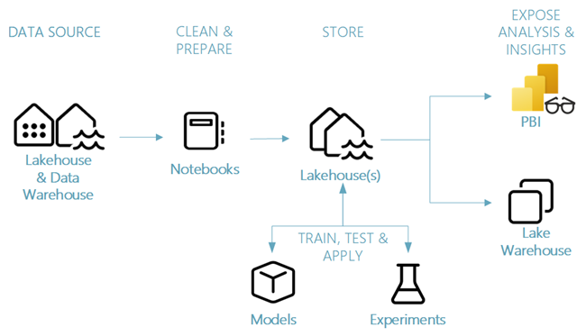

This part of the workshop covers Data Scien portion. This tutorials present a complete end-to-end scenario in the Fabric data science experience. They cover each step, from Data ingestion
Data cleaning
Data preparation
Machine learning model training
Insight generation
and then cover consumption of those insights with visualization tools - for example, Power BI.

These tutorials place you in the role of a data scientist who must explore, clean, and transform a dataset that contains the churn status of 10,000 bank customers. You then build a machine learning model to predict which bank customers will likely leave.

1. Setup Lakehouse to store data and manually upload [data](/DataScienceTutorial/data/)
2. [Explore and clean data using notebook](https://learn.microsoft.com/en-us/fabric/data-science/tutorial-data-science-explore-notebook)
3. [Train and register a machine learning model](https://learn.microsoft.com/en-us/fabric/data-science/tutorial-data-science-train-models)
4. [Perform batch scoring and save predictions to a lakehouse](https://learn.microsoft.com/en-us/fabric/data-science/tutorial-data-science-batch-scoring)
5. [Visualize predictions with a Power BI report](https://learn.microsoft.com/en-us/fabric/data-science/tutorial-data-science-create-report)

[Here](https://learn.microsoft.com/en-us/fabric/data-science/use-ai-samples) are some additional tutorials.