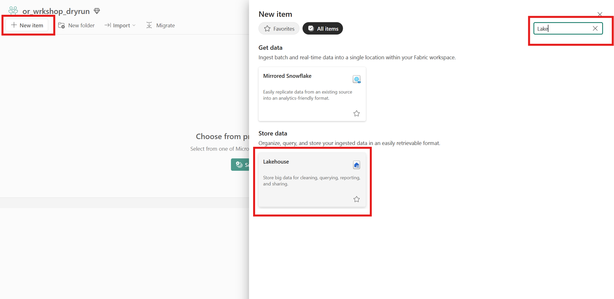

Follow below steps to setup Lakehouse in Fabric and upload provided [data](../data/bankcustomerchurn_churn.csv)

1. Navigate to your Fabric Workspace and click on "+ New Item" button on  top-left corner
2. Search for "Lakehouse" in the New Item section and select "Lakehouse"

3. Enter "lh_data_Store" as name of the lakehouse and check the "Lakehouse schemas" checkbox
