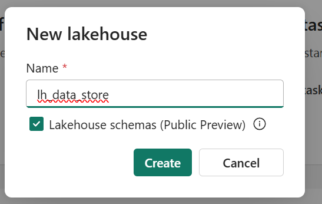

Follow below steps to setup Lakehouse in Fabric and upload provided [data](../data/bankcustomerchurn_churn.csv)

### Create Lakehouse
1. Navigate to your Fabric Workspace and click on "+ New Item" button on  top-left corner
2. Search for "Lakehouse" in the New Item section and select "Lakehouse"

3. Enter "lh_data_Store" as name of the lakehouse, check the "Lakehouse schemas" checkbox, and hit "Create"

Now, you have a Lakehouse created

### Upload data
1. In the Lakehouse, click on three dots next to "Files" and then click "New Subfolder"

2. Name the new subfolder "sample data" and hit "create"

3. Now, click on three dots next to "sample_data" folder and click on "Upload > Upload Files"

4. Once the new window shows up, browse to your local storage where you stored [data](/DataScienceTutorial/data) provide in this repo. And, upload the data

5. If you see the csv file inside the sub-folder, then you're good. You may need to refresh the page.

Now, you can move to [Explore and clean data using notebook](/DataScienceTutorial/workbooks/ExploreAndCleanData.md)