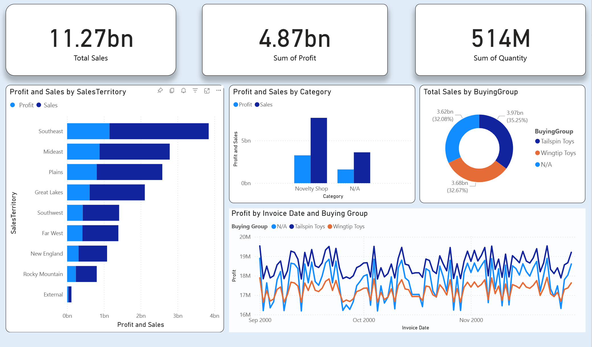
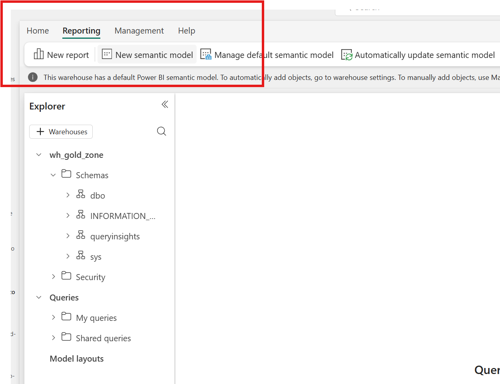
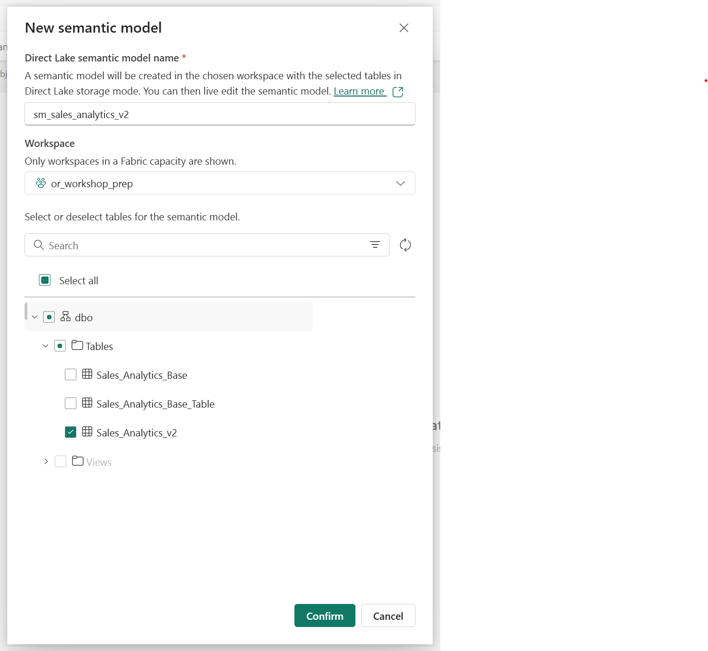

## Financial Overview report
1. Overall Sales
2. Overall Profit
3. Total Items sold
4. Total Sales and Profit by Territory
5. Total Sales Profit by Customer Category
6. Total Sales by Buying Group
7. Daily Sales & Profit trend line

### Steps
1. Go to Gold Zone > Reporting > New Semantic Model 

2. Navogate to newly created Semantic Model and create a blank report
3. Follow along on the call