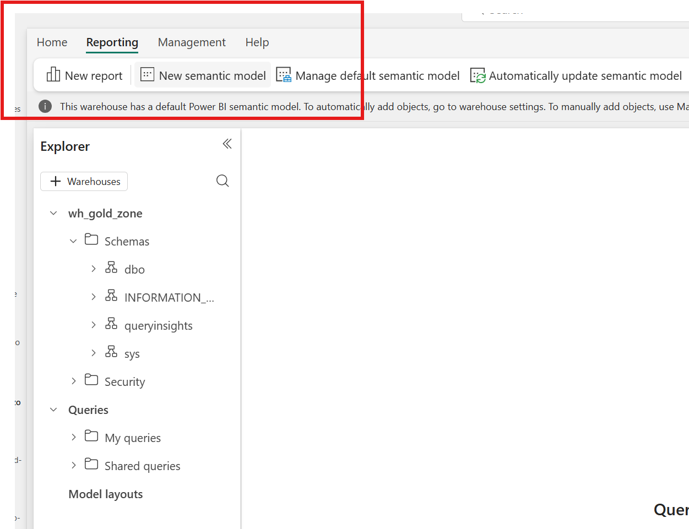
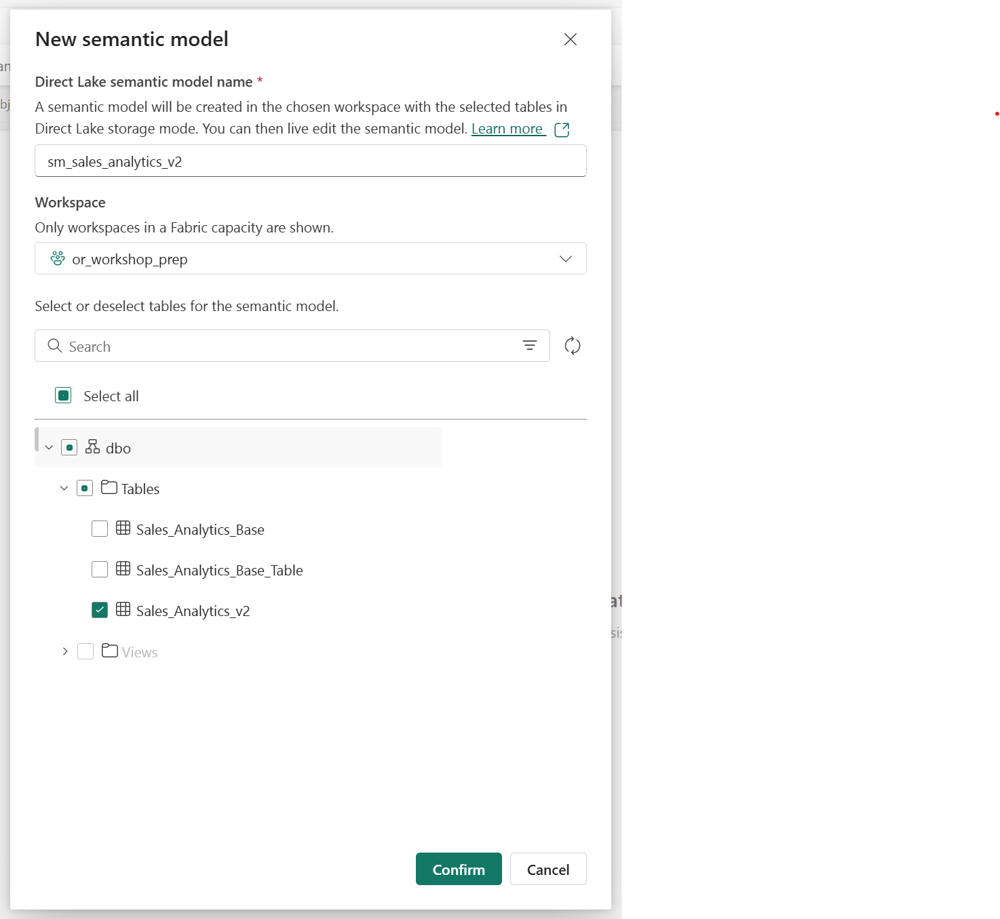

This repo contains steps, links, and code for conducting a simple Fabric workshop. User's should be able to follow along by following steps in this guide.

# Add architecture diagram

# Understand data 
For this tutorial we will use World WIde Importers Dataset which is available within Fabric as one of the sample datasets. You can learn about this dataset [here](https://learn.microsoft.com/en-us/sql/samples/wide-world-importers-what-is?view=sql-server-ver17).

# Steps

### Medalion Architecture setup
1. Create lakehouse as bronze zone by following this [guide](https://learn.microsoft.com/en-us/fabric/data-engineering/tutorial-build-lakehouse).
2. Create another lakehouse as silver zone 
3. Create data warehouse as gold zone following this [guide](https://learn.microsoft.com/en-us/fabric/data-warehouse/create-warehouse). Note: Create 'Warehouse', not 'Sample warehouse'.

### Ingest Data and Build Data Pipelines
1. Create data pipline to ingest data into Bronze Zone
2. Data pipeline to clean and move data from Bronze to Silver zone
3. Data pipeline to move from Silver to Gold Zone. This pipeline's processing is informed by what is needed in the report. So, we will bring only following table

### Create PowerBI reports
1. Semantic Model creation : Go to Gold Zone > Reporting > New Semantic Model 

2. Go back to the workspace > 
2. Exploration
3. Manual report creation
4. Auto-report creation
5. DAX query writing

### Use Copilot
1. Copilot assited report creation
2. Chat with your data using copilot