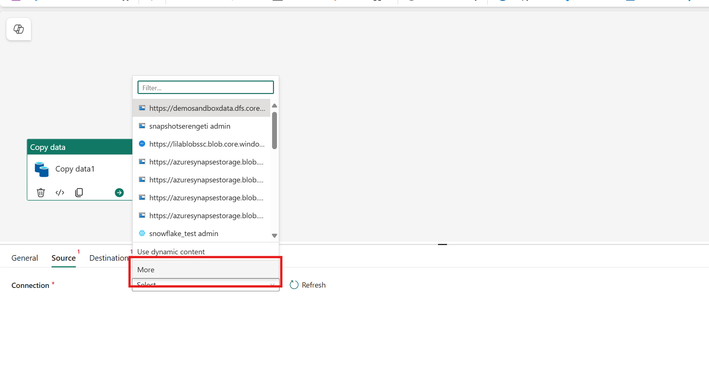
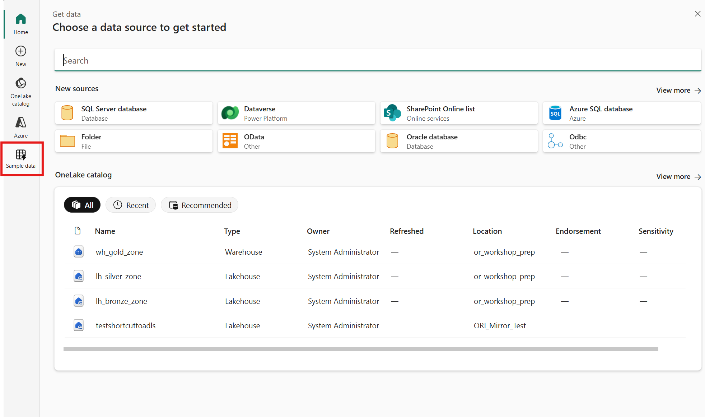
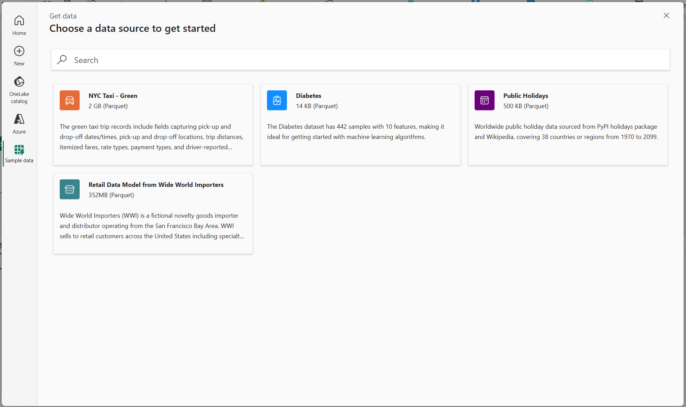
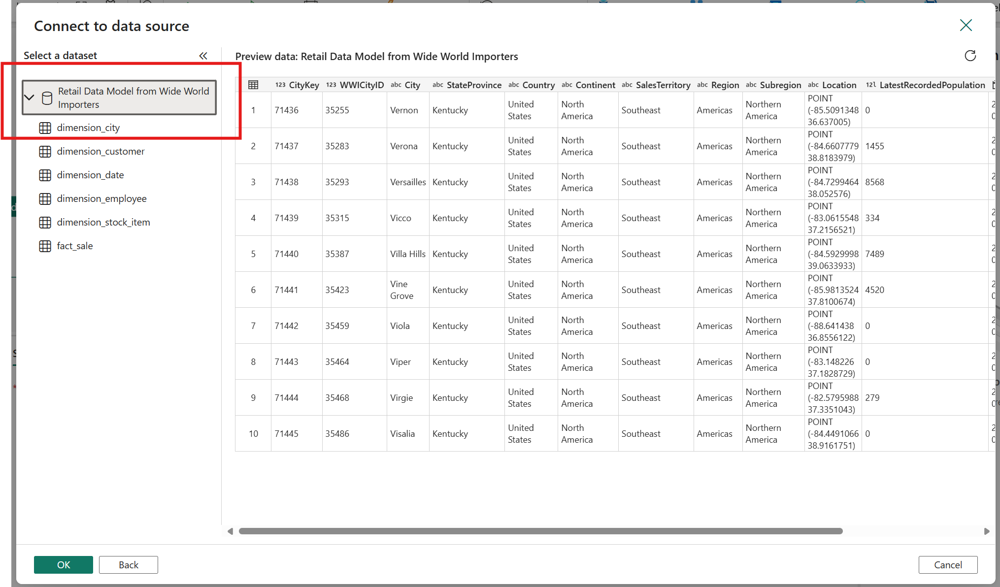
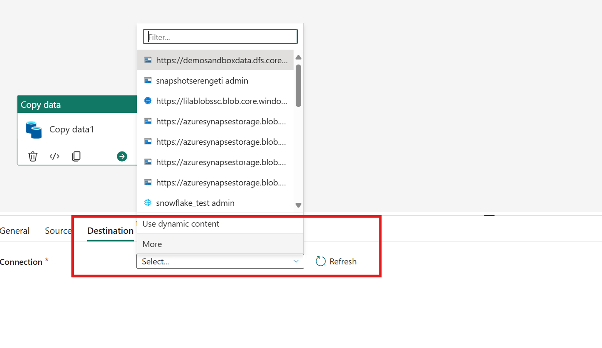
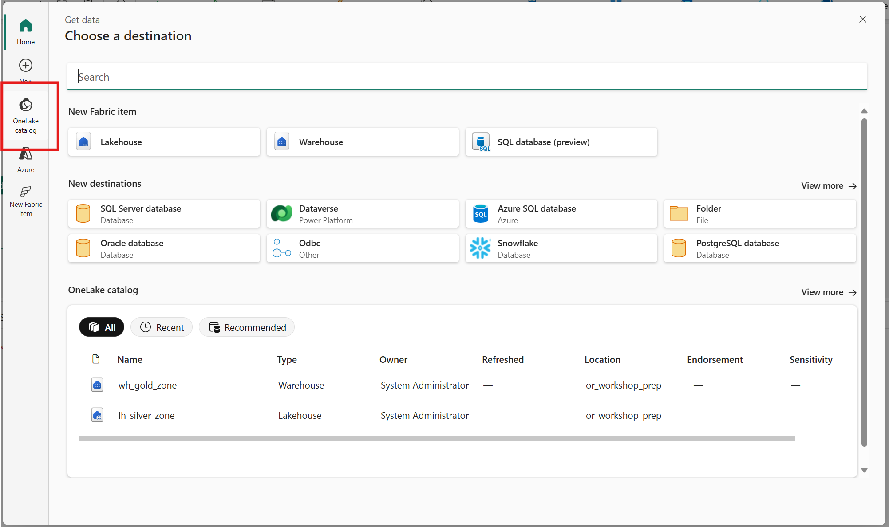
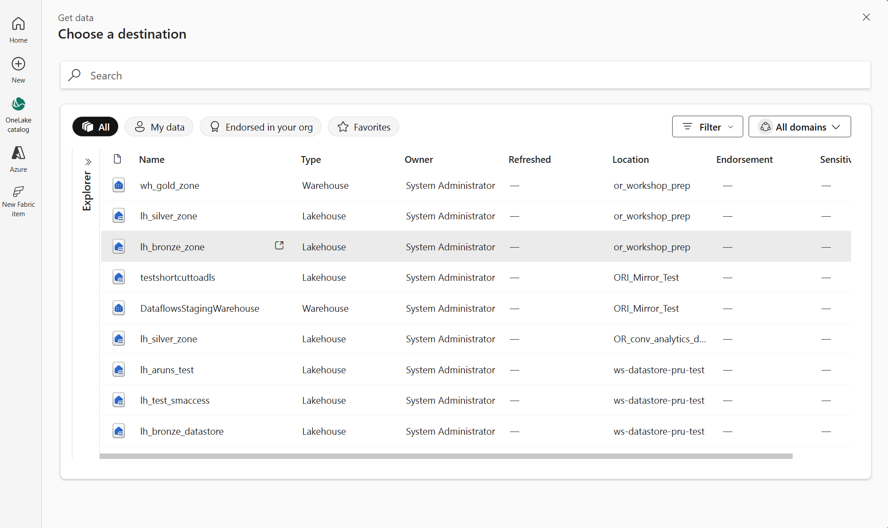
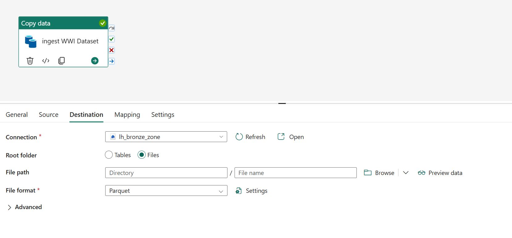
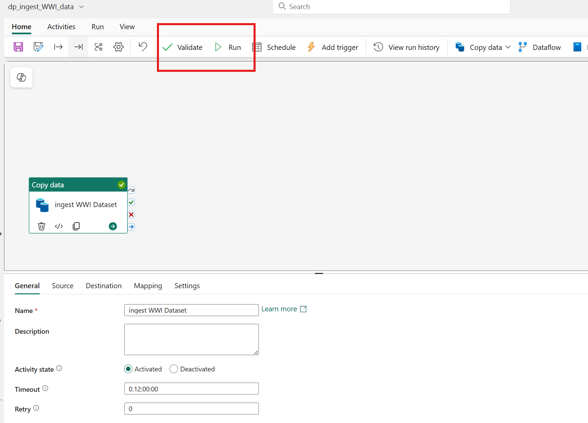
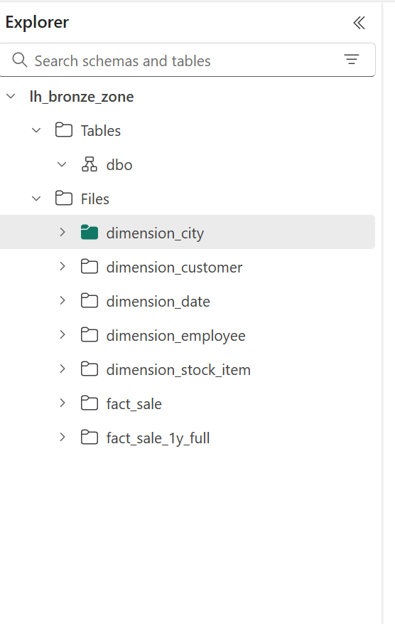

 Ensure you selete the dataset and not a single table.

Destination configuration

Update Name of the copy activity 

Validate and Run the pipeline.

Your broze zone lakehouse should show data in Files section as below
