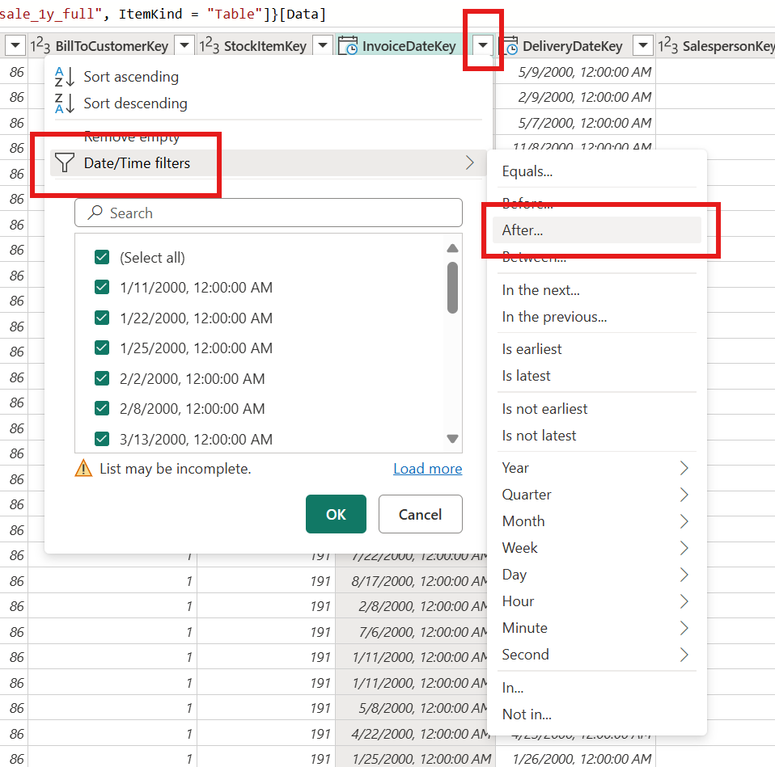
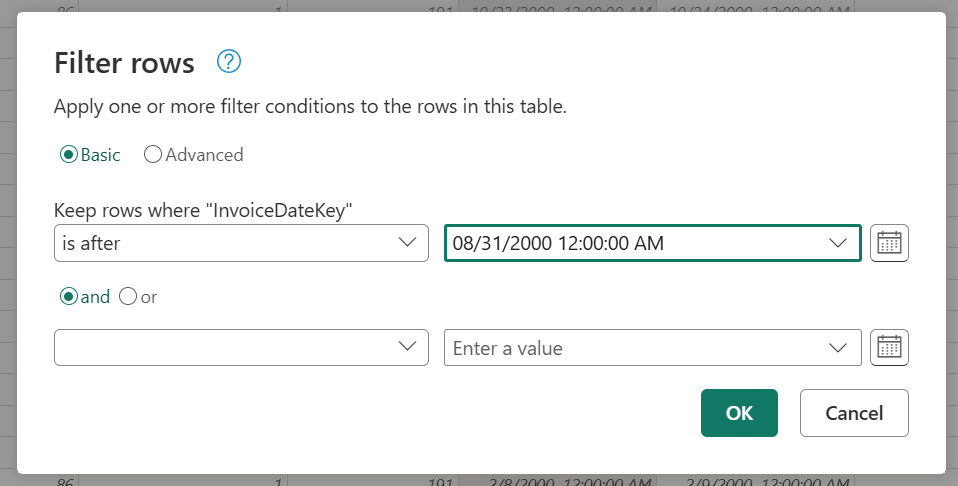
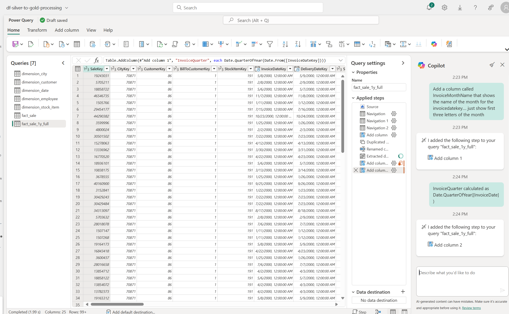
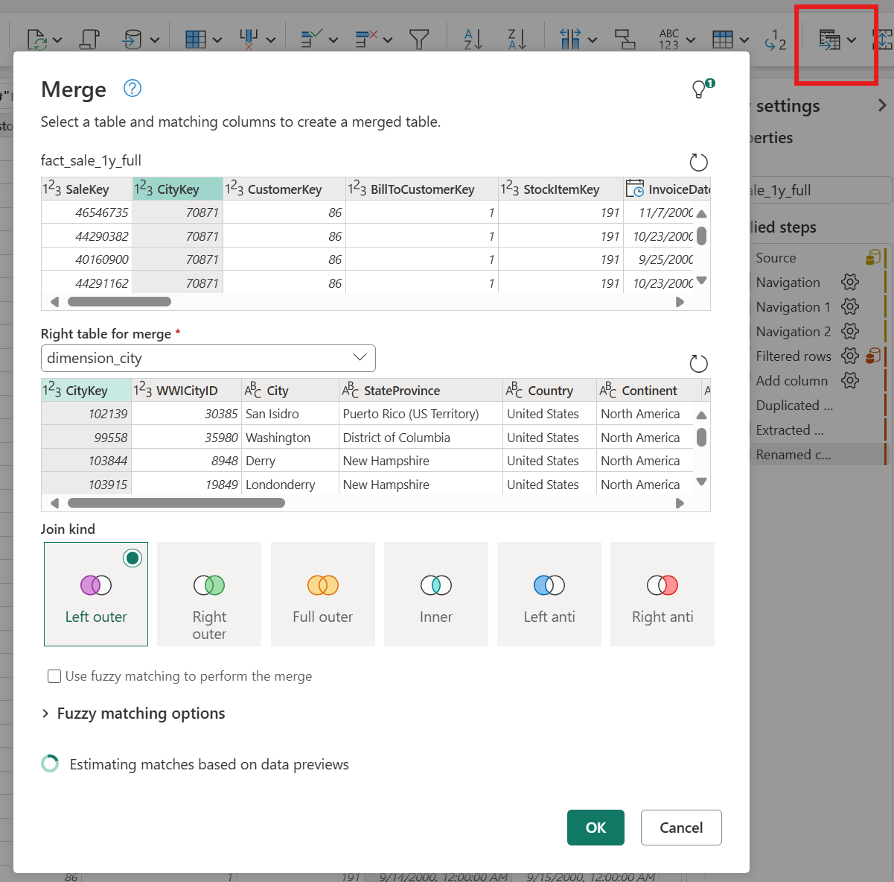
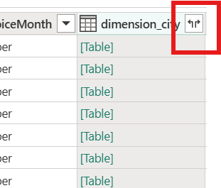
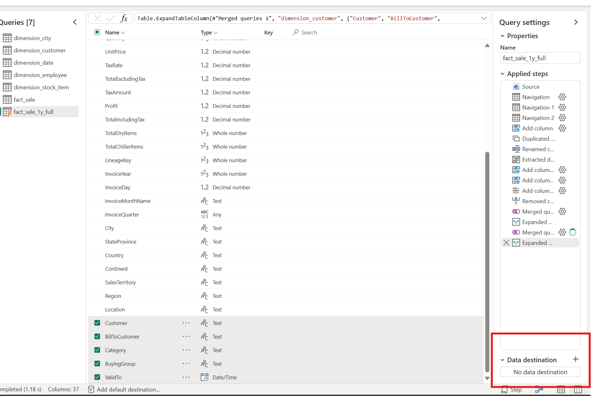
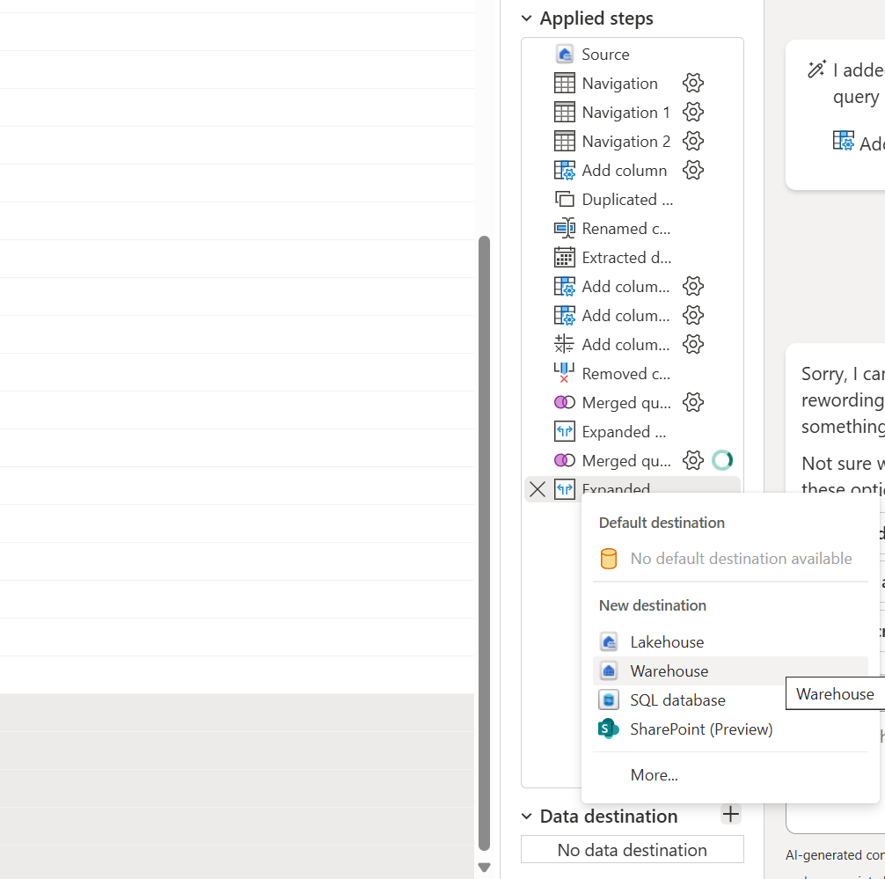
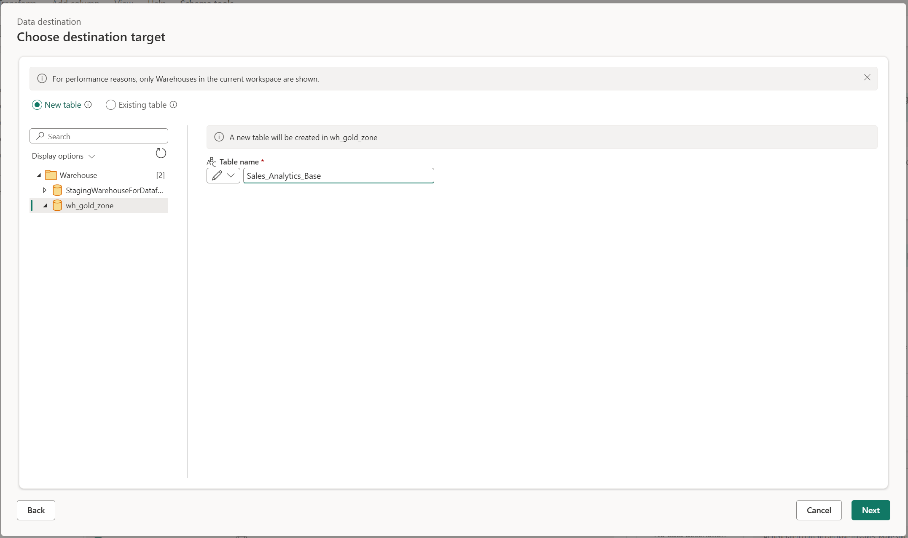
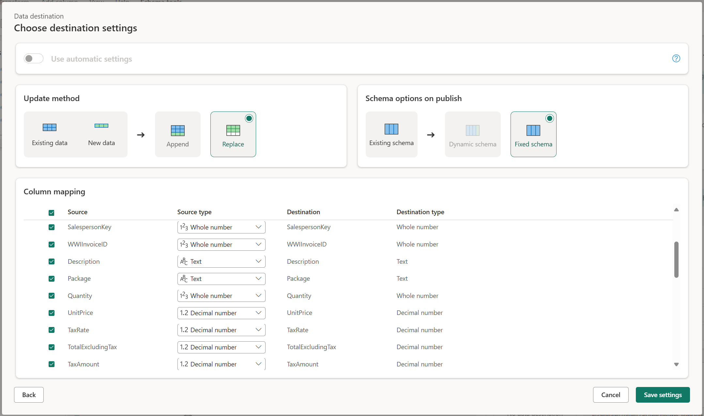
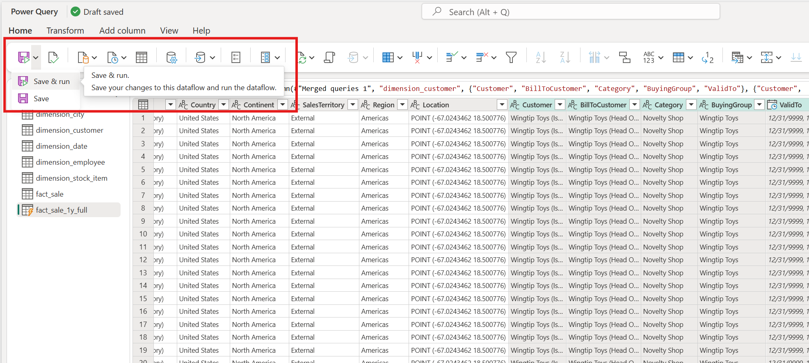

This document lists detailed steps to move and transform data from Silver ZOne to Gold Zone. We will use Dataflow Gen2 for this task.

# Report we will build
## Financial Overview report
1. Overall Sales
2. Overall Profit
3. Total Items sold
4. Total Sales and Profit by Territory
5. Total Sales Profit by Customer Category
6. Daily Sales & Profit trend line

# Building the pipeline
## Dataflow Gen2 for procesing data
1. Create Dataflow Gen2 and name it df-silver-to-gold
2. Connect to your silver zone as source
3. Select following tables to Bring in
    1. fact_sale_1y_full
    2. dimension_city
    3. dimention_customer
4. For fact_sale_1y_full : Filter down rows to only include rows with values greater than "08/31/2000 12:00:00 AM" in InvoiceDateKey column

5. Using copilot, add a column InvoiceYear which is calculated as Date.Year([InvoiceDate]). 

6.  Great, similarly add below listed columns 
7. Manually add anohter column InvoiceMonth. 
    1. Right Click on InvoiceDateKey > Duplicate Column
    2. On the new column, Right Click > Transform Column > Month > Month Name
    3. On the new column, Right Click > Rename 
8. InvoiceQuarter calculated as Date.QuarterOfYear([InvoiceDate])
9. Join Tables
    1. fact_Sale_1y_full with dimension_city on City_Key : Click Merge query while you have fact_Sale_1y_full selected > Select dimension_city as the other table > select city_key as column in both tables > select left join > hit ok

    2. Select columns by clicking on icon showed below. Select "City" and "SalesTerritory"
    
    3. Similarly join fact_sale_1y_full and dimension_customer on customerKey and select "Buying Group" and "Category"

10. Add Destination to the Dataflow for storing the end result. Remember you need to do this for each table you want to store to destination. For this demo we will save just fact_sale_1y_full

 Leave everythin as is

Save & Run

Track progress
